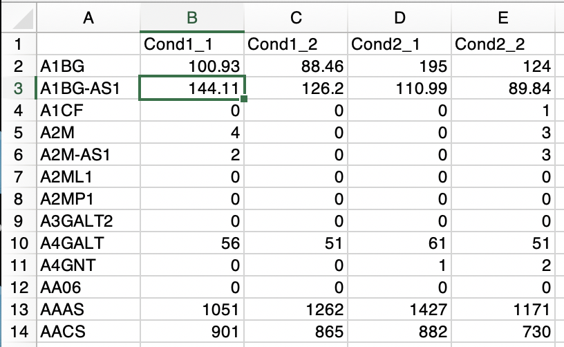
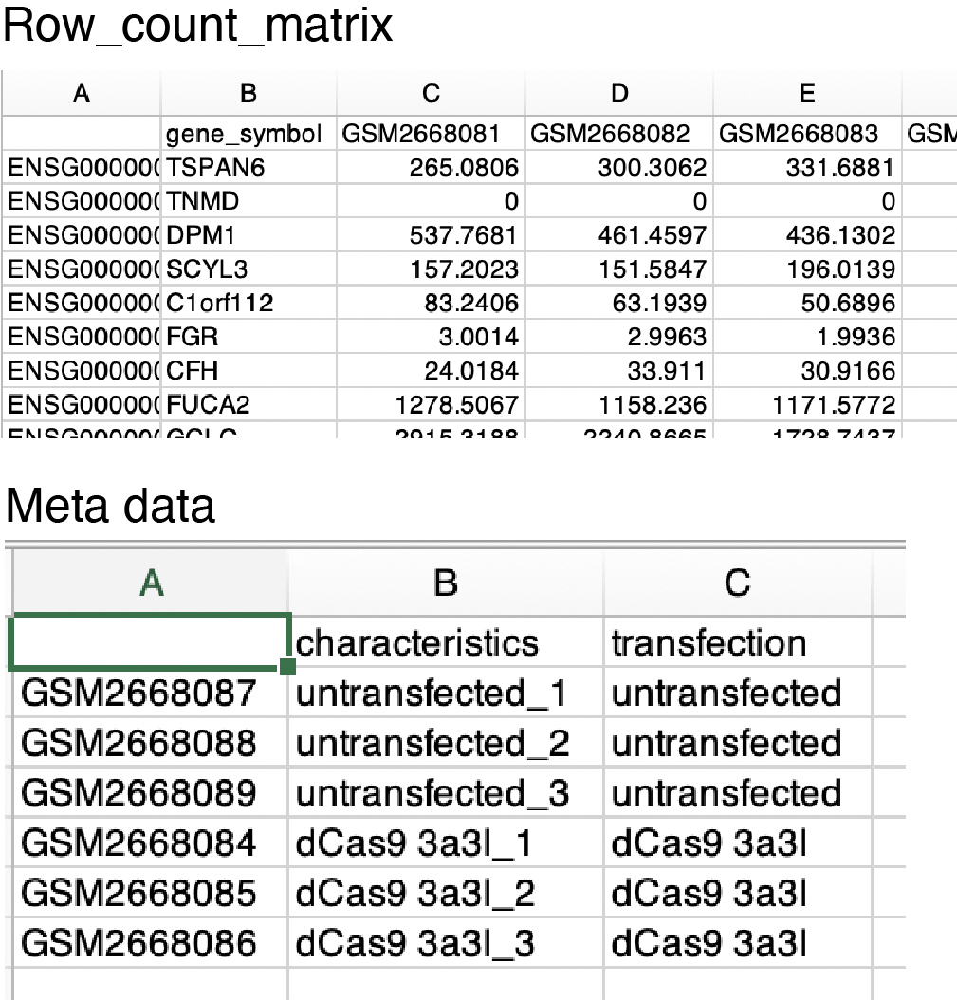
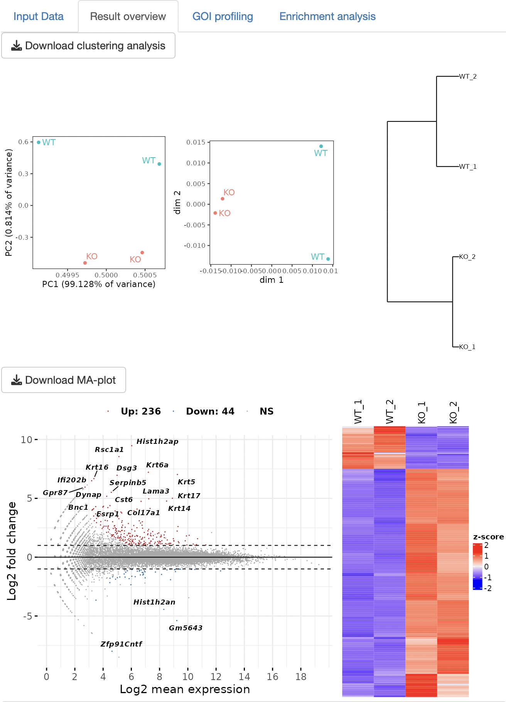
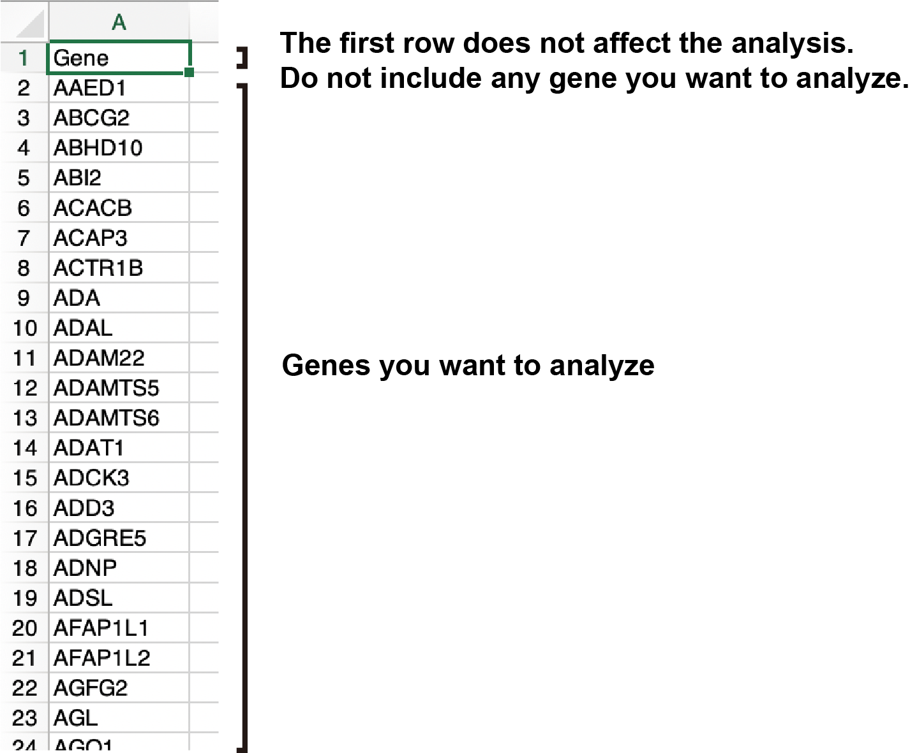
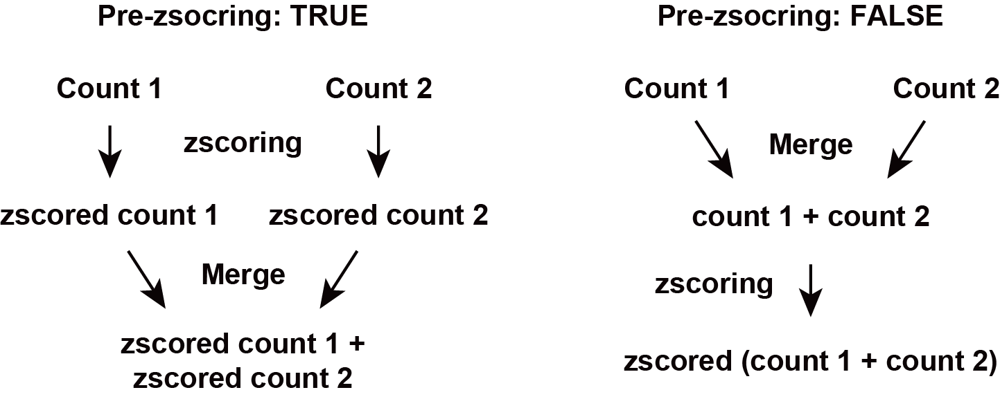
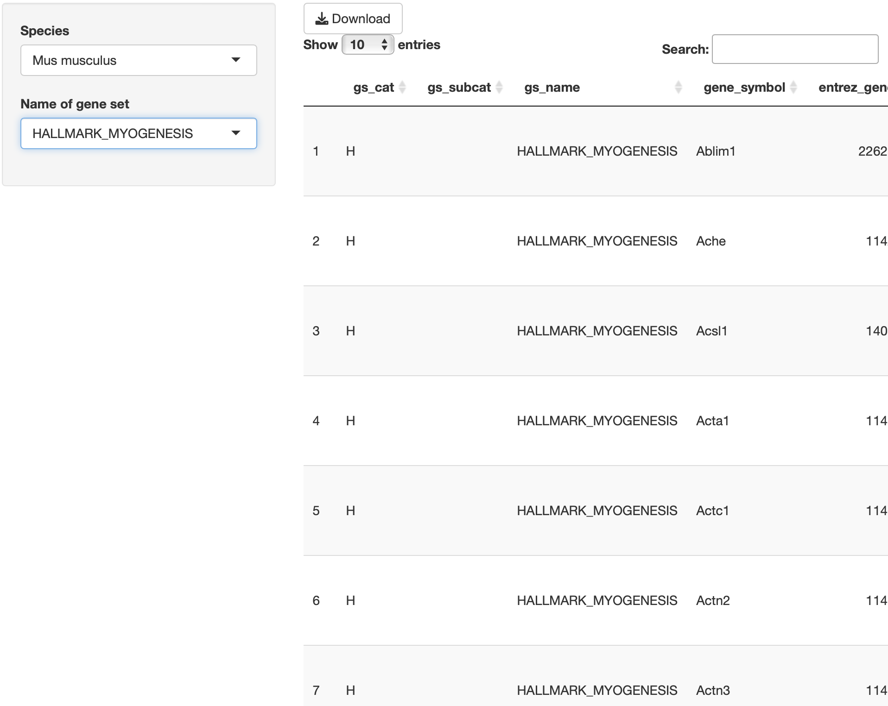
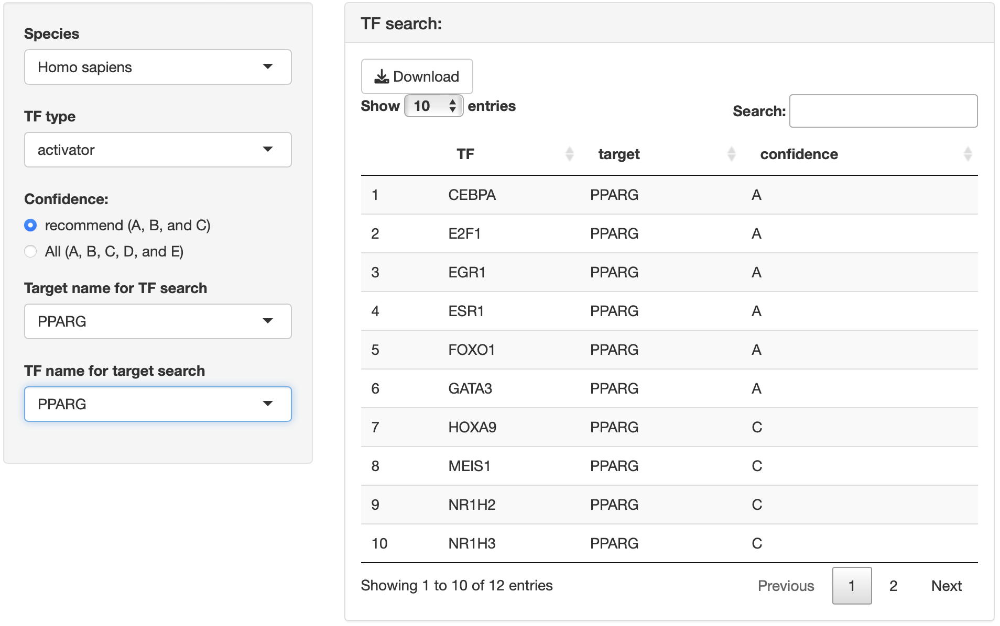
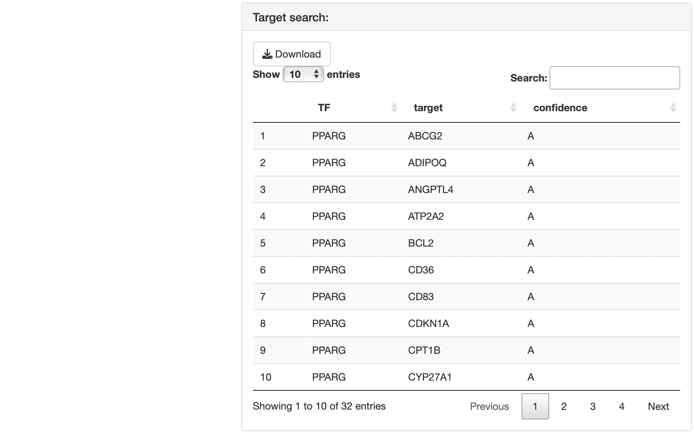

```{r setup, include=FALSE}
source("global.R")
library(biomaRt)
library(monaLisa)
library(GenomicRanges)
library(BiocParallel)
library(SummarizedExperiment)
library(JASPAR2020)
library(TFBSTools)
library(BSgenome.Mmusculus.UCSC.mm10)
library(BSgenome.Hsapiens.UCSC.hg19)
library(TxDb.Mmusculus.UCSC.mm10.knownGene)
library(TxDb.Hsapiens.UCSC.hg19.knownGene)
knitr::opts_chunk$set(echo = TRUE)
```

------------------------------------------------------------------------

[](https://doi.org/10.5281/zenodo.7095218)<br>

# Outline

{#id .class width="70%"} <br><br>

RNAseqChef, RNA-seq data controller highlighting gene expression feature, a web-based platform of systematic transcriptome analysis which can automatically detect, integrate, and visualize the differentially expressed genes and their biological function without bioinformatics skills. Furthermore, Users can analyze not only a single dataset but also integrate and evaluate multiple datasets.<br> 
You can download a publication-ready high resolution figure (PDF file that can be edited by Illustrator).<br><br> 
RNAseqChef can be used in the following way:<br> 
1. Access [the web page](https://imeg-ku.shinyapps.io/RNAseqChef/) <br> 
2. Execute the code described in "Local installation" on [the source code page](https://github.com/Kan-E/RNAseqChef) in R <br><br> 
Web page: <https://imeg-ku.shinyapps.io/RNAseqChef/> <br> 
Source code: <https://github.com/Kan-E/RNAseqChef> <br> 
Japanese manual: <https://kan-e.github.io/RNAseqChef_manual_japanese> <br> 
Please contact me: Kan Etoh, [kaneto\@kumamoto-u.ac.jp](mailto:kaneto@kumamoto-u.ac.jp){.email} <br><br><br>


RNAseqChef consists of the following sections:<br>

-   **Pair-wise DEG** (Differential expression analysis for pair-wise comparison)

-   **3 conditions DEG** (Differential expression analysis for 3 conditions multiple comparison)

-   **Multi DEG** (Differential expression analysis for multiple comparison by likelihood ratio test)

-   **Venn diagram** (Visualization of the intersections of gene lists)

-   **Normalized count analysis** (Clustering analysis for normalized count data)

-   **Enrichment viewer** (Functional analysis of gene cluster list)

-   **More**（Other useful functions, Reference, etc）

To establish the utility, flexibility and versatility of RNAseqChef, we designed to divide the core functions into 6 sections, which enables us to handle various types of input files. <br>
The user-interface consists of **Menu**, **Setting panel**, **Tab panel**.<br> Each section can be moved by clicking the menu button.<br> Input files can be uploaded in the setting panel.<br> RNA-seq analysis is automatically started by clicking the tab panel in the output panel.<br> Please explore the app's features with the example data by clicking **the example button** in the setting panel.<br><br> {.class width="70%"} <br>

------------------------------------------------------------------------

# Common rules and important notice for input file

### File extension

Tab-separated txt file (.txt), comma-separated csv file (.csv), and excel file (.xlsx) are accepted.<br><br>

### Duplication of gene names

Be careful with the autocorrect function of Excel that causes gene name errors.<br> Depending on the version of Excel, **gene name conversion/duplication occurs just by opening the file**.（For example, March1 → 1-Mar, Marc1 → 1-Mar）<br> RNAseqChef cannot handle files containing duplicate gene names.<br> If you edit the file in Excel, ensure no misconversions in the gene names.<br><br>

------------------------------------------------------------------------

# Common rules and important notice for output file

### Data save

By pressing the download button, the table data and graph will be saved. Table data is saved as a tab-separated txt file (.txt), and graphs are saved as a PDF file that can be edited by Adobe Illustrator.<br> Only in batch mode of pair-wise DEG, multiple files are saved in zip format.<br><br>

### Adjusting the plot size

You can change the figure size by adjusting "Output plot size setting for pdf" in the Setting panel.<br> You can adjust the parameters when adjacent characters overlap in the graph or when the margins of the graph are too large.<br> If the value of the parameter is 0, it will be saved in the default size.<br> The default size depends on the type of graph. For details, please see the pop-up in the app.<br><br>

------------------------------------------------------------------------

# Pair-wise DEG

**Pair-wise DEG** detects and visualizes differentially expressed genes. This function executes a series of pair-wise DEG analyses such as "DEG (differentially expressed gene) detection", "clustering analysis", and "enrichment analysis".

## Setting

{.class width="50%"}<br>

------------------------------------------------------------------------

### Input format

Three types of raw count data formats can be used as input.<br> By clicking the button as shown below, the upload format can be switched.<br> {.class width="100%"}<br>

#### 1. **raw count data** <br>

Analysis can only be performed with raw count data if the following conditions are fulfilled:

    - A file consists of only two groups of data to be analyzed.
    - The replication number is represented by the underline “_”.
    - Do not use the underline "_" for anything else. 

{.class width="50%"}<br>　

------------------------------------------------------------------------

#### 2. **raw count data + metadata** <br>

You can use this format if the above conditions are not fulfilled, for example, if the sample name is an accession number or if the raw count data contains extra information that is not the subject of analysis.<br> Metadata must contain the following information:

    - The first column is the sample name used in the raw count data.（ex. accession number）
    - The second column is the corresponding sample name that matches the sample name in the first column. (e.g. Control_1)
    - The third and subsequent columns do not affect the analysis.

{.class width="50%"} <br><br>

#### 3. **raw count data (Batch mode)** <br>

Batch processing can only be performed with raw count data if the following conditions are fulfilled:

-   A file consists of only two groups of data to be analyzed. - The replication number is represented by the underline "*". - Do not use the underline "*" for anything else. In this batch mode, result data can not be displayed in the output panel.\
    You can get the zip files including Clustering, MA_plot, DEG_result, DEG count data (up and down), and normalized count data, by clicking the download button. {.class width="50%"} <br>　

------------------------------------------------------------------------

#### DEG analysis method

The following three types of DEG analysis can be selected.

-   [DESeq2](https://genomebiology.biomedcentral.com/articles/10.1186/s13059-014-0550-8)
-   [edgeR](https://academic.oup.com/bioinformatics/article/26/1/139/182458)
-   [EBSeq](https://academic.oup.com/bioinformatics/article/29/8/1035/228913) <br>

#### FDR, False Discovery Rate, method

The following three types of FDR methods can be selected if the DEG analysis method is DESeq2 or edgeR.

-   BH, Benjamini-Hochberg method (default)
-   Qvalue, Storey method
-   [IHW, Independent Hypothesis Weighting](https://www.nature.com/articles/nmeth.3885) <br>

#### Species

The following analysis is performed by selecting the dataset species.

    - Conversion to gene symbol if the gene name is ENSEMBL ID
    - Performing enrichment analysis

<br>

#### Cut-off conditions

Three types of thresholds, **Fold change**, **FDR**, and **base mean**, can be set. <br> <br>

#### Option: normalized count input

Base mean cut-off can be set with the uploaded normalized count data such as TPM counts.<br> The y-axis of the boxplot can be displayed with the uploaded normalized count data.<br> Note: Uploading raw count data is not unnecessary. <br> <br>

------------------------------------------------------------------------

## Output

### Input Data

The uploaded raw count data is displayed.<br> In the case of the "Raw count data + metadata" format, it also displays the raw count data that is redefined using the uploaded metadata. <br><br> {.class width="70%"}<br><br>

------------------------------------------------------------------------

### Result overview

Three types of clustering analysis are performed: Principal Component Analysis (PCA), Multi-Dimensional Scaling (MDS), and hierarchical clustering with the ward.D2.<br> The DEG analysis that is selected in the setting panel is performed to detect DEGs. MA-plot and heatmap are displayed as a result of the DEG analysis.<br> The table data of the DEG analysis is displayed.<br> {.class width="80%"}<br>

------------------------------------------------------------------------

### GOI (Genes of interest) profiling

The volcano plot is displayed.<br> By selecting genes from the GOI list, you can label only the GOI among the points displayed in the volcano plot.<br> The x-axis and y-axis ranges can be freely changed by operating the slide bar.<br> The heatmap and boxplot of the genes selected from the GOI list are displayed.<br><br> {.class width="80%"}<br> {.class width="80%"} <br>

------------------------------------------------------------------------

### Enrichment analysis

Over-representation analysis and GSEA, Gene set enrichment analysis, are performed to identify the function of DEGs.<br> The gene set can be selected from the following: <br>[MSigDB hallmark gene](http://www.gsea-msigdb.org/gsea/msigdb/genesets.jsp?collection=H) <br> [KEGG](https://www.kegg.jp) <br> [Reactome](https://reactome.org) <br> [PID (Pathway Interaction Database)](https://maayanlab.cloud/Harmonizome/resource/Pathway+Interaction+Database) <br> [BioCarta](https://maayanlab.cloud/Harmonizome/dataset/Biocarta+Pathways) <br> [WikiPathways](https://www.wikipathways.org/index.php/WikiPathways) <br> [GO (biological process, cellular component, and molecular function)](http://geneontology.org) <br> [Human phenotype ontology](https://hpo.jax.org/app/) <br> [DoRothEA regulon (activator)](https://saezlab.github.io/dorothea/) <br> [DoRothEA regulon (repressor)](https://saezlab.github.io/dorothea/) <br> [Transcription factor targets](http://www.gsea-msigdb.org/gsea/msigdb/genesets.jsp?collection=TFT) <br> [miRNA target](http://www.gsea-msigdb.org/gsea/msigdb/genesets.jsp?collection=MIR) <br>

Dotplot, GSEA plot, and gene-concept network, cnet, plot are displayed as the result. <br> Enrichment analysis depends on [ClusterProfiler](https://yulab-smu.top/biomedical-knowledge-mining-book/enrichplot.html). <br> {.class width="80%"}<br>

------------------------------------------------------------------------

# 3 conditions DEG

3 conditions DEG detects and visualizes differentially expressed genes by EBSeq multi-comparison analysis.<br> Note: Multiple comparison analysis takes 5-10 minutes.

## Setting

{.class width="50%"}<br>

------------------------------------------------------------------------

### Input format

The input format and settings for 3conditions DEG are the same as for pair-wise DEG.<br> If you have read the description of pair-wise DEG, you do not need to read the below.<br><br>

Two types of raw count data formats can be used as input.<br>

#### 1. **raw count data** <br>

Analysis can only be performed with raw count data if the following conditions are fulfilled:

    - A file consists of only three groups of data to be analyzed.
    - The replication number is represented by the underline “_”.
    - Do not use the underline "_" for anything else. 

{.class width="50%"} <br>　

------------------------------------------------------------------------

#### 2. **raw count data + metadata** <br>

You can use this format if the above conditions are not fulfilled, for example, if the sample name is an accession number or if the raw count data contains extra information that is not the subject of analysis.<br> Metadata must contain the following information:

    - The first column is the sample name used in the raw count data.（ex. accession number）
    - The second column is the corresponding sample name that matches the sample name in the first column. (e.g. Control_1)
    - The third and subsequent columns do not affect the analysis.

{.class width="50%"} <br><br>

------------------------------------------------------------------------

#### Species

The following analysis is performed by selecting the dataset species.

    - Conversion to gene symbol if the gene name is ENSEMBL ID
    - Performing enrichment analysis

<br>

#### Cut-off conditions

Three types of thresholds, **Fold change**, **FDR**, and **base mean**, can be set. <br> <br>

#### Option: normalized count input

Base mean cut-off can be set with the uploaded normalized count data such as TPM counts.<br> The y-axis of the boxplot can be displayed with the uploaded normalized count data.<br> Note: Uploading raw count data is not unnecessary. <br> <br>

------------------------------------------------------------------------

## Output

### Input Data

The uploaded raw count data is displayed.<br> In the case of the "Raw count data + metadata" format, it also displays the raw count data that is redefined using the uploaded metadata. <br><br> {.class width="60%"}

------------------------------------------------------------------------

### Result overview

Three types of clustering analysis are performed: Principal Component Analysis (PCA), Multi-Dimensional Scaling (MDS), and hierarchical clustering with the ward.D2.<br> EBSeq multi-comparison analysis is performed to detect DEGs. Scatter plot and heatmap are displayed as a result of the DEG analysis.<br> By visualizing DEGs in all three conditions, the characteristics of gene expression in each condition can be extracted.<br> The table data of the DEG analysis is displayed.<br><br>

{.class width="80%"}<br> {.class width="80%"}<br> {.class width="80%"} <br>

------------------------------------------------------------------------

### GOI (Genes of interest) profiling

The heatmap and boxplot of the genes selected from the GOI list are displayed.<br><br> {.class width="80%"}<br> {.class width="80%"}<br>

------------------------------------------------------------------------

### Enrichment analysis

Over-representation analysis is performed to identify the function of DEGs.<br> The gene set can be selected from the following: <br>[MSigDB hallmark gene](http://www.gsea-msigdb.org/gsea/msigdb/genesets.jsp?collection=H) <br> [KEGG](https://www.kegg.jp) <br> [Reactome](https://reactome.org) <br> [PID (Pathway Interaction Database)](https://maayanlab.cloud/Harmonizome/resource/Pathway+Interaction+Database) <br> [BioCarta](https://maayanlab.cloud/Harmonizome/dataset/Biocarta+Pathways) <br> [WikiPathways](https://www.wikipathways.org/index.php/WikiPathways) <br> [GO (biological process, cellular component, and molecular function)](http://geneontology.org) <br> [Human phenotype ontology](https://hpo.jax.org/app/) <br> [DoRothEA regulon (activator)](https://saezlab.github.io/dorothea/) <br> [DoRothEA regulon (repressor)](https://saezlab.github.io/dorothea/) <br> [Transcription factor targets](http://www.gsea-msigdb.org/gsea/msigdb/genesets.jsp?collection=TFT) <br> [miRNA target](http://www.gsea-msigdb.org/gsea/msigdb/genesets.jsp?collection=MIR) <br>

Dotplot and gene-concept network, cnet, plot are displayed as the result. <br> Enrichment analysis depends on [ClusterProfiler](https://yulab-smu.top/biomedical-knowledge-mining-book/enrichplot.html). <br> {.class width="80%"} <br>

------------------------------------------------------------------------

# Multi DEG

Multi DEG detects and visualizes differentially expressed genes by LRT(Likelihood Ratio Test) DESeq2.<br>

## Setting

{.class width="50%"}<br>

------------------------------------------------------------------------

### Input format

Two types of raw count data formats can be used as input.<br>

#### 1. **raw count data** <br>

Analysis can only be performed with raw count data if the following conditions are fulfilled:

    - The replication number is represented by the underline “_”.
    - Do not use the underline "_" for anything else. 

{.class width="50%"} <br>　

------------------------------------------------------------------------

#### 2. **raw count data + metadata** <br>

In this formats, you can visualize the result of two-factor multiple comparison. Metadata must contain the following information:

    - The first column is the sample name used in the raw count data.
    - In the first column, the replication number is represented by the underline “_”.
    - The second column is the corresponding first condition name that matches the sample name in the first column. 
    - The third is the corresponding second condition name that matches the sample name in the first column. 

{.class width="50%"} <br><br>

------------------------------------------------------------------------

#### FDR, False Discovery Rate, method

The following three types of FDR methods can be selected if the DEG analysis method is DESeq2 or edgeR.

-   BH, Benjamini-Hochberg method (default)
-   Qvalue, Storey method
-   [IHW, Independent Hypothesis Weighting](https://www.nature.com/articles/nmeth.3885) <br>

#### Species

The following analysis is performed by selecting the dataset species.

    - Conversion to gene symbol if the gene name is ENSEMBL ID
    - Performing enrichment analysis

<br>

#### Cut-off conditions

Three types of thresholds, **Fold change**, **FDR**, and **base mean**, can be set. <br> <br>

#### Option: normalized count input

Base mean cut-off can be set with the uploaded normalized count data such as TPM counts.<br> The y-axis of the boxplot can be displayed with the uploaded normalized count data.<br> Note: Uploading raw count data is not unnecessary. <br> <br>

------------------------------------------------------------------------

## Output

### Input Data

The uploaded raw count data is displayed.<br> In the case of the "Raw count data + metadata" format, it also displays the raw count data that is redefined using the uploaded metadata. <br><br> {.class width="80%"}<br> {.class width="80%"}<br>

------------------------------------------------------------------------

### Result overview

Four types of clustering analysis are performed: Principal Component Analysis (PCA), Multi-Dimensional Scaling (MDS), hierarchical clustering with the ward.D2, and UMAP (Uniform Manifold Approximation and Projection).<br> Heatmap of DEGs is displayed as a result of the DEG analysis.<br> The table data of the DEG analysis is displayed.<br><br>

n_neighbors in UMAP is the parameter that controls how UMAP balances local versus global structure in the data.<br> Low values of n_neighbors will force UMAP to concentrate on very local structure, while large values will push UMAP to look at larger neighborhoods of each point.<br> In the case of a small number of samples, n_neighbors should be small.<br><br> {.class width="80%"}<br> {.class width="80%"}<br>

------------------------------------------------------------------------

### Divisive clustering

Hierarchical clustering by a top-down clustering approach is performed.<br> The cluster number is automatically determined.<br> Boxplot showing gene expression pattern of each cluster is displayed.<br> The table data showing the relationship between gene and clusters is displayed.<br> Over-representation analysis is performed to identify the function of each cluster.<br> The gene set can be selected from the following: <br>[MSigDB hallmark gene](http://www.gsea-msigdb.org/gsea/msigdb/genesets.jsp?collection=H) <br> [KEGG](https://www.kegg.jp) <br> [Reactome](https://reactome.org) <br> [PID (Pathway Interaction Database)](https://maayanlab.cloud/Harmonizome/resource/Pathway+Interaction+Database) <br> [BioCarta](https://maayanlab.cloud/Harmonizome/dataset/Biocarta+Pathways) <br> [WikiPathways](https://www.wikipathways.org/index.php/WikiPathways) <br> [GO (biological process, cellular component, and molecular function)](http://geneontology.org) <br> [Human phenotype ontology](https://hpo.jax.org/app/) <br> [DoRothEA regulon (activator)](https://saezlab.github.io/dorothea/) <br> [DoRothEA regulon (repressor)](https://saezlab.github.io/dorothea/) <br> [Transcription factor targets](http://www.gsea-msigdb.org/gsea/msigdb/genesets.jsp?collection=TFT) <br> [miRNA target](http://www.gsea-msigdb.org/gsea/msigdb/genesets.jsp?collection=MIR) <br>

Dotplot and gene-concept network, cnet, plot are displayed as the result. <br> The group displayed by the cnet plot can be switched by selecting from the "Group" list.<br> Enrichment analysis depends on [ClusterProfiler](https://yulab-smu.top/biomedical-knowledge-mining-book/enrichplot.html). <br><br>

**Select a pair for fold change cut-off**<br> The Fold Change between the selected two groups is subject to "the Cut-off condition" in the setting panel.<br> This function is effective when you want to extract genes that change remarkably only between specific groups.<br>

**Most significant genes**<br> The DEG after cut-off is extracted in ascending order of FDR, and clustering analysis is performed.<br> If there are too many DEGs after cut-off, there is a risk of freezing due to server memory, so narrow down the genes to be analyzed.<br>

{.class width="80%"}<br> {.class width="80%"}<br> {.class width="80%"}<br> {.class width="80%"}<br> {.class width="80%"}<br> {.class width="80%"}<br>

------------------------------------------------------------------------

### k-means clustering

k-means clustering is performed.<br> The number of clusters can be changed by operating the slide bar.<br> Boxplot showing gene expression pattern of each cluster is displayed.<br> The table data showing the relationship between gene and clusters is displayed.<br>

Over-representation analysis is performed to identify the function of each cluster.<br>

**Select a pair for fold change cut-off**<br> The Fold Change between the selected two groups is subject to "the Cut-off condition" in the setting panel.<br> This function is effective when you want to extract genes that change remarkably only between specific groups.<br>

**Most significant genes**<br> The DEG after cut-off is extracted in ascending order of FDR, and clustering analysis is performed.<br> If there are too many DEGs after cut-off, there is a risk of freezing due to server memory, so narrow down the genes to be analyzed.<br>

{.class width="80%"}<br> {.class width="80%"}<br> {.class width="80%"}<br> {.class width="80%"}<br> {.class width="80%"}<br> {.class width="80%"}<br>

------------------------------------------------------------------------

### GSEA

GSEA (gene set enrichment analysis) is performed to identify the function of each cluster.<br> The gene set can be selected from the following: <br>[MSigDB hallmark gene](http://www.gsea-msigdb.org/gsea/msigdb/genesets.jsp?collection=H) <br> [KEGG](https://www.kegg.jp) <br> [Reactome](https://reactome.org) <br> [PID (Pathway Interaction Database)](https://maayanlab.cloud/Harmonizome/resource/Pathway+Interaction+Database) <br> [BioCarta](https://maayanlab.cloud/Harmonizome/dataset/Biocarta+Pathways) <br> [WikiPathways](https://www.wikipathways.org/index.php/WikiPathways) <br> [GO (biological process, cellular component, and molecular function)](http://geneontology.org) <br> [Human phenotype ontology](https://hpo.jax.org/app/) <br> [DoRothEA regulon (activator)](https://saezlab.github.io/dorothea/) <br> [DoRothEA regulon (repressor)](https://saezlab.github.io/dorothea/) <br> [Transcription factor targets](http://www.gsea-msigdb.org/gsea/msigdb/genesets.jsp?collection=TFT) <br> [miRNA target](http://www.gsea-msigdb.org/gsea/msigdb/genesets.jsp?collection=MIR) <br>

Enrichment analysis depends on [ClusterProfiler](https://yulab-smu.top/biomedical-knowledge-mining-book/enrichplot.html). <br><br>

{.class width="80%"} <br>

------------------------------------------------------------------------

# Venn diagram

Venn diagram detects and visualizes the overlap between DEGs from multiple datasets.<br> By combining with the count data, you can extract the count data of the common part and create a heatmap.<br><br>

## Setting

{.class width="50%"}<br><br>

------------------------------------------------------------------------

### Input format

#### Gene list

The format of the gene list used as input is as follows.

    - The first column is gene name.
    - The second and subsequent columns do not affect the analysis.
    - The maximum number of uploads is 7 files.
    - File names do not use "." other than the extension.

There is no problem even if count data is included because the second and subsequent columns do not affect the analysis.<br> Venn diagram analysis from **Up to seven files** is performed, and the gene list including each intersection of the Venn diagram can be obtained.<br><br> {.class width="15%"}<br><br>

#### Multiple count files（for integrated heatmap）

Multiple count data is integrated, and then the expression of the gene set identified by the Venn diagram is visualized.<br> Count data must fulfill the following condition.

    - Use a normalized count file, not raw count file.
    - File names do not use "." other than the extension.

<br> {.class width="50%"}<br><br>

------------------------------------------------------------------------

#### Option: pre-zscoring

If True, each count data is z-scored before integrating multiple count data.<br> <br> {.class width="50%"}<br><br>

------------------------------------------------------------------------

## Output

### Input gene list

The Venn diagram created from the uploaded gene list is displayed.<br> For all genes included in the uploaded list, the group to which the Venn diagram belongs is displayed as a list.<br> **How to read the gene list**<br> The group displayed in the Venn diagram is created based on the file name of the uploaded gene list (in the case of the below, day0.txt, day1.txt, and day5.txt are uploaded).<br> The common part is represented by a colon ":" (in the case of below, **day0:day1:day5** = "common part of day0, day1, day5", **day0:day1** = "common part of day0 and day1, but not day5", and **day0** = "unique part of day0".） <br> {.class width="80%"}<br> {.class width="80%"}<br>

------------------------------------------------------------------------

### Integrated heatmap

Multiple count data is integrated and then genes of the intersection of the Venn diagram are visualized by heatmap.<br> The intersection to be visualized can be switched by selecting from "gene list".<br> Two types of integrated count tables are output.<br> integrated normalized count is the result of combining multiple count data without the z-scoring.<br> Integrated zscored normalized count is z-scored count data. If pre-zscoring is TRUE, it will be z-scored before combining multiple data, and if pre-zscoring is False, it will be z-scored after combining the data.<br> By selecting the 'not selected' from the "gene list", it is also possible to obtain the integrated count data that contains all genes. <br> {.class width="80%"}<br> {.class width="80%"}<br> {.class width="80%"}<br>

------------------------------------------------------------------------

### Enrichment analysis

Over-representation analysis is performed to identify the function of each cluster.<br> The gene set can be selected from the following: <br>[MSigDB hallmark gene](http://www.gsea-msigdb.org/gsea/msigdb/genesets.jsp?collection=H) <br> [KEGG](https://www.kegg.jp) <br> [Reactome](https://reactome.org) <br> [PID (Pathway Interaction Database)](https://maayanlab.cloud/Harmonizome/resource/Pathway+Interaction+Database) <br> [BioCarta](https://maayanlab.cloud/Harmonizome/dataset/Biocarta+Pathways) <br> [WikiPathways](https://www.wikipathways.org/index.php/WikiPathways) <br> [GO (biological process, cellular component, and molecular function)](http://geneontology.org) <br> [Human phenotype ontology](https://hpo.jax.org/app/) <br> [DoRothEA regulon (activator)](https://saezlab.github.io/dorothea/) <br> [DoRothEA regulon (repressor)](https://saezlab.github.io/dorothea/) <br> [Transcription factor targets](http://www.gsea-msigdb.org/gsea/msigdb/genesets.jsp?collection=TFT) <br> [miRNA target](http://www.gsea-msigdb.org/gsea/msigdb/genesets.jsp?collection=MIR) <br>

Dotplot and gene-concept network, cnet, plot are displayed as the result. <br> The group displayed by the cnet plot can be switched by selecting from the "Group" list.<br> Enrichment analysis depends on [ClusterProfiler](https://yulab-smu.top/biomedical-knowledge-mining-book/enrichplot.html). <br><br> {.class width="80%"} <br> {.class width="80%"} <br>

------------------------------------------------------------------------

# Normalized count analysis

Normalized count analysis identifies similar samples and gene expression patterns by clustering methods.<br> By uploading the gene list, you can extract only the count data of the gene of interest, and then perform clustering analysis.<br> k-means clustering identifies gene groups that show similar expression patterns. <br><br>

## Setting

{.class width="50%"}<br>

------------------------------------------------------------------------

### Input format

The input format for normalized count analysis is the same as for pair-wise DEG and 3 conditions DEG.<br> If you have read the description of pair-wise DEG or 3 conditions DEG, you do not need to read the below.<br><br>

#### 1. **raw count data** <br>

Analysis can only be performed with raw count data if the following conditions are fulfilled:

    - The replication number is represented by the underline “_”.
    - Do not use the underline "_" for anything else. 

{.class width="0%"} <br>　

------------------------------------------------------------------------

#### 2. **raw count data + metadata** <br>

You can use this format if the above conditions are not fulfilled, for example, if the sample name is an accession number or if the raw count data contains extra information that is not the subject of analysis.<br> Metadata must contain the following information:

    - The first column is the sample name used in the raw count data.（ex. accession number）
    - The second column is the corresponding sample name that matches the sample name in the first column. (e.g. Control_1)
    - The third and subsequent columns do not affect the analysis.

{.class width="50%"} <br><br>

------------------------------------------------------------------------

#### Species

The following analysis is performed by selecting the dataset species.

    - Conversion to gene symbol if the gene name is ENSEMBL ID

<br><br>

#### Filter option 1

In the case that the gene list is uploaded, clustering analysis of the normalized count data is performed after the gene extraction with the gene list. <br> <br>

#### Filter option 2

The base mean threshold can be set. <br> <br>

------------------------------------------------------------------------

## Output

### Input Normalized Count Data

The uploaded files are displayed.<br> In the case that metadata and gene list are uploaded, it also show the normalized count data that is re-defined with metadata and gene list. <br> {.class width="80%"} <br>

------------------------------------------------------------------------

### Clustering

Three types of clustering analysis are performed: Principal Component Analysis (PCA), Multi-Dimensional Scaling (MDS), and hierarchical clustering with the ward.D2.<br>

{.class width="80%"}<br> {.class width="80%"}<br>

------------------------------------------------------------------------

### GOI (Genes of interest) profiling

The heatmap and boxplot of the genes selected from the GOI list are displayed.<br><br>

<br> {.class width="80%"}<br> {.class width="80%"}<br>

------------------------------------------------------------------------

### k-means clustering

k-means clustering is performed.<br> The number of clusters can be changed by operating the slide bar.<br> The table data showing the relationship between gene and clusters is displayed.

<br> {.class width="80%"}<br> {.class width="80%"}<br> {.class width="80%"}<br>

------------------------------------------------------------------------

# Enrichment viewer

Enrichment viewer determines and visualizes biological functions of gene set of interest.<br> By using the results of the Venn diagram and k-means clustering, the functions of the identified gene groups can be compared and visualized. <br><br>

## Setting

{.class width="50%"}<br><br><br><br>

------------------------------------------------------------------------

### Input format

The format of the gene list used as input is as follows.<br>

    - The first column is gene name
    - The second column is the corresponding group name that matches the gene name in the first column.
    - The third and subsequent columns do not affect the analysis.

There is no problem even if count data is included because the third and subsequent columns do not affect the analysis.<br> You can use the table data obtained by the Venn diagram or k-means clustering without changing the format.<br><br>

------------------------------------------------------------------------

#### Species

The following analysis is performed by selecting the dataset species.

    - Conversion to gene symbol if the gene name is ENSEMBL ID
    - Performing enrichment analysis

<br>

------------------------------------------------------------------------

#### Most significant pathways

You can change the number of pathways displayed in the graphs. <br>

------------------------------------------------------------------------

## Output

### Input gene list for enrichment analysis

The uploaded gene list is displayed.<br>

{.class width="80%"} <br>

------------------------------------------------------------------------

### Enrichment analysis

Over-representation analysis is performed to identify the function of gene sets.<br> The gene set can be selected from the following:<br> [MSigDB hallmark gene](http://www.gsea-msigdb.org/gsea/msigdb/genesets.jsp?collection=H) <br> [KEGG](https://www.kegg.jp) <br> [Reactome](https://reactome.org) <br> [PID (Pathway Interaction Database)](https://maayanlab.cloud/Harmonizome/resource/Pathway+Interaction+Database) <br> [BioCarta](https://maayanlab.cloud/Harmonizome/dataset/Biocarta+Pathways) <br> [WikiPathways](https://www.wikipathways.org/index.php/WikiPathways) <br> [GO (biological process, cellular component, and molecular function)](http://geneontology.org) <br> [Human phenotype ontology](https://hpo.jax.org/app/) <br> [DoRothEA regulon (activator)](https://saezlab.github.io/dorothea/) <br> [DoRothEA regulon (repressor)](https://saezlab.github.io/dorothea/) <br> [Transcription factor targets](http://www.gsea-msigdb.org/gsea/msigdb/genesets.jsp?collection=TFT) <br> [miRNA target](http://www.gsea-msigdb.org/gsea/msigdb/genesets.jsp?collection=MIR) <br>

Dotplot and gene-concept network, cnet, plot are displayed as the result. <br> The group displayed by the cnet plot can be switched by selecting from the "Group" list.<br> Enrichment analysis depends on [ClusterProfiler](https://yulab-smu.top/biomedical-knowledge-mining-book/enrichplot.html). <br> {.class width="80%"}<br> {.class width="80%"}<br>

------------------------------------------------------------------------

### Promoter motif analysis

Promoter motif analysis identifies DNA-binding motifs that enrich the promoter region of each gene group.<br> Species: human (hg19) or mouse (mm10)<br> 
Upstream: upstream range from the TSS <br> 
Downstream: downstream range from the TSS<br> 
padj: threshold for dotplot<br> 
Press "Start" button to start the analysis.<br><br>

By selecting a motif of interest from the "Motif table", you can display the region where Motif exists (limited to the specified TSS region of the enriched gene group) in the "Motif region".<br> This analysis depends on [monaLisa](https://fmicompbio.github.io/monaLisa/articles/monaLisa.html).<br>

{.class width="80%"}<br> {.class width="80%"}<br> {.class width="80%"}<br>

------------------------------------------------------------------------

# More

## Volcano navi

Volcano navi shows volcano plot.<br> The input format is as follows.

    - The first column is gene name.
    - A file includes columns named "log2FoldChange" and "padj".
    - Other columns do not affect the analysis.

You can use not only RNA-seq data but also the other omics data.<br> By selecting genes from the GOI list, you can label only the GOI among the points displayed in the volcano plot.<br> The x-axis and y-axis ranges can be freely changed by operating the slide bar.<br> In the case that the normalized count data is uploaded, the heatmap and boxplot of the genes selected from the GOI list are displayed.<br>

{.class width="100%"}<br>

------------------------------------------------------------------------

## MSigDB gene set

The gene sets registered with [MSigDB (Molecular Signatures Data Base)](http://www.gsea-msigdb.org/gsea/msigdb/genesets.jsp) can be downloaded in this section.<br>

{.class width="100%"}<br>

------------------------------------------------------------------------

## DoRothEA regulon

[DoRothEA (Discriminant Regulon Expression Analysis)](https://saezlab.github.io/dorothea/) allows you to browse the data of DoRothEA.<br> By entering the gene name in "Target name for TF search" and "TF name for target search", bi-directional search of "transcription factor ⇄ target gene" is possible.<br> 
**Confidence** <br>
The official page recommends data with reliable **confidence A-C**.<br>
Enrichment analysis by RNAseqChef uses data with **confidence A-C** to increase the accuracy of transcription factor prediction.

{.class width="100%"}<br> {.class width="100%"}<br>

------------------------------------------------------------------------

## Reference

Shiny framework

-   Winston Chang, Joe Cheng, JJ Allaire, Carson Sievert, Barret Schloerke, Yihui Xie, Jeff Allen, Jonathan McPherson, Alan Dipert and Barbara Borges (2021). shiny: Web Application Framework for R. R package version 1.7.1. <https://CRAN.R-project.org/package=shiny>
-   Eric Bailey (2022). shinyBS: Twitter Bootstrap Components for Shiny. R package version 0.61.1. <https://CRAN.R-project.org/package=shinyBS>
-   Yihui Xie, Joe Cheng and Xianying Tan (2022). DT: A Wrapper of the JavaScript Library 'DataTables'. R package version 0.23. <https://CRAN.R-project.org/package=DT>

EBSeq (for ebseq)

-   Ning Leng and Christina Kendziorski (2020). EBSeq: An R package for gene and isoform differential expression analysis of RNA-seq data. R package version 1.30.0.

DESeq2 (for deseq2)

-   Love, M.I., Huber, W., Anders, S. Moderated estimation of fold change and dispersion for RNA-seq data with DESeq2 Genome Biology 15(12):550 (2014)

edgeR (for edger)

-   Robinson MD, McCarthy DJ and Smyth GK (2010). edgeR: a Bioconductor package for differential expression analysis of digital gene expression data. Bioinformatics 26, 139-140

IHW, Independent hypothesis weighting, and qvalue (for fdr control method of deseq2 and edger)

-   Nikolaos Ignatiadis, Bernd Klaus, Judith Zaugg and Wolfgang Huber (2016): Data-driven hypothesis weighting increases detection power in genome-scale multiple testing. Nature Methods 13:577, doi: 10.1038/nmeth.3885
-   John D. Storey, Andrew J. Bass, Alan Dabney and David Robinson (2021). qvalue: Q-value estimation for false discovery rate control. R package version 2.26.0. <http://github.com/jdstorey/qvalue>

ggdendro (for dendrograms)

-   Andrie de Vries and Brian D. Ripley (2020). ggdendro: Create Dendrograms and Tree Diagrams Using 'ggplot2'. R package version 0.1.22. <https://CRAN.R-project.org/package=ggdendro>

umap (for UMAP)

-   Konopka T (2022). *umap: Uniform Manifold Approximation and Projection*. R package version 0.2.8.0, <https://CRAN.R-project.org/package=umap>.

clusterProfiler, DOSE, msigdbr, dorothea (for enrichment analysis)

-   T Wu, E Hu, S Xu, M Chen, P Guo, Z Dai, T Feng, L Zhou, W Tang, L Zhan, X Fu, S Liu, X Bo, and G Yu. clusterProfiler 4.0: A universal enrichment tool for interpreting omics data. The Innovation. 2021, 2(3):100141
-   Guangchuang Yu, Li-Gen Wang, Guang-Rong Yan, Qing-Yu He. DOSE: an R/Bioconductor package for Disease Ontology Semantic and Enrichment analysis. Bioinformatics 2015 31(4):608-609
-   Dolgalev I (2022). *msigdbr: MSigDB Gene Sets for Multiple Organisms in a Tidy Data Format*. R package version 7.5.1, <https://CRAN.R-project.org/package=msigdbr>.
-   Garcia-Alonso L, Holland CH, Ibrahim MM, Turei D, Saez-Rodriguez J. 'Benchmark and integration of resources for the estimation of human transcription factor activities.' Genome Research. 2019. DOI: 10.1101/gr.240663.118.

AnnotationDbi, org.Hs.eg.db, org.Mm.eg.db, org.Rn.eg.db, org.Xl.eg.db, org.Dm.eg.db, and org.Ce.eg.db (for genome wide annotation)

-   Hervé Pagès, Marc Carlson, Seth Falcon and Nianhua Li (2020). AnnotationDbi: Manipulation of SQLite-based annotations in Bioconductor. R package version 1.52.0. <https://bioconductor.org/packages/AnnotationDbi>
-   Marc Carlson (2020). org.Hs.eg.db: Genome wide annotation for Human. R package version 3.12.0.
-   Marc Carlson (2020). org.Mm.eg.db: Genome wide annotation for Mouse. R package version 3.12.0.
-   Marc Carlson (2022). org.Rn.eg.db: Genome wide annotation for Rat. R package version 3.15.0.
-   Marc Carlson (2022). org.Xl.eg.db: Genome wide annotation for Worm. R package version 3.15.0.
-   Marc Carlson (2022). org.Dm.eg.db: Genome wide annotation for Rat. R package version 3.15.0.
-   Marc Carlson (2022). org.Ce.eg.db: Genome wide annotation for Worm. R package version 3.15.0.

genefilter (for z-score normalization)

-   R. Gentleman, V. Carey, W. Huber and F. Hahne (2021). genefilter: methods for filtering genes from high-throughput experiments. R package version 1.72.1.

ComplexHeatmap (for heatmap and k-means clustering)

-   Gu, Z. (2016) Complex heatmaps reveal patterns and correlations in multidimensional genomic data. Bioinformatics.

ggplot2 and ggpubr (for boxplot and scater plot)

-   H. Wickham. ggplot2: Elegant Graphics for Data Analysis. Springer-Verlag New York, 2016.
-   Alboukadel Kassambara (2020). ggpubr: 'ggplot2' Based Publication Ready Plots. R package version 0.4.0. <https://CRAN.R-project.org/package=ggpubr>

DEGreport (for divisive clustering analysis)

-   Pantano L (2022). DEGreport: Report of DEG analysis. R package version 1.32.0, <http://lpantano.github.io/DEGreport>

venn (for venn diagram analysis)

-   Adrian Dusa (2021). venn: Draw Venn Diagrams. R package version 1.10. <https://CRAN.R-project.org/package=venn>

dplyr and tidyr (for data manipulation)

-   Hadley Wickham, Romain François, Lionel Henry and Kirill Müller (2021). dplyr: A Grammar of Data Manipulation. R package version 1.0.7. <https://CRAN.R-project.org/package=dplyr>
-   Hadley Wickham (2021). tidyr: Tidy Messy Data. R package version 1.1.3. <https://CRAN.R-project.org/package=tidyr>

sample data

-   R. Takase, S. Hino, K. Nagaoka, K. Anan, K. Kohrogi, H. Araki, Y. Hino, A. Sakamoto, T. B. Nicholson, T. Chen, M. Nakao, Lysine-specific demethylase-2 is distinctively involved in brown and beige adipogenic differentiation. FASEB J. 33, 5300--5311 (2019).
-   Saunderson EA, Stepper P, Gomm JJ, Hoa L et al. Hit-and-run epigenetic editing prevents senescence entry in primary breast cells from healthy donors. Nat Commun 2017 Nov 13;8(1):1450. PMID: 29133799

------------------------------------------------------------------------

# License

This shiny code is licensed under the GPLv3. Please see the file LICENSE.md for information.

    RNAseqChef, an RNA-seq data controller highlighting gene expression features
    Shiny App for automated, systematic, and integrated RNA-seq differential expression analysis
    Copyright (C) 2022  Kan Etoh

    This program is free software: you can redistribute it and/or modify
    it under the terms of the GNU General Public License as published by
    the Free Software Foundation, either version 3 of the License, or
    (at your option) any later version.

    This program is distributed in the hope that it will be useful,
    but WITHOUT ANY WARRANTY; without even the implied warranty of
    MERCHANTABILITY or FITNESS FOR A PARTICULAR PURPOSE.  See the
    GNU General Public License for more details.

    You should have received a copy of the GNU General Public License
    along with this program.  If not, see <http://www.gnu.org/licenses/>.

    You may contact the author of this code, Kan Etoh, at <kaneto@kumamoto-u.ac.jp>

------------------------------------------------------------------------

# Session info

```{r, echo = TRUE}
 sessionInfo()
```
